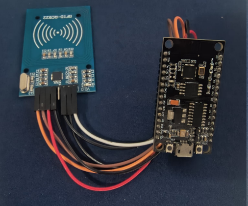
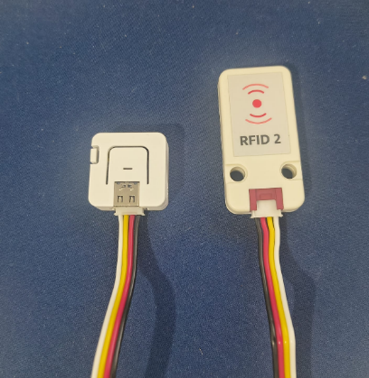

# Lectores RFID de las paradas

Cada parada tiene un lector que lee el UID del llavero RFID de la persona y lo publica por MQTT en RabbitMQ. El backend recibe el mensaje, crea la alerta y la envía al conductor.

```
Llavero RFID → Lector (ESP8266 / AtomS3) → Wi-Fi → MQTT :1883 → RabbitMQ → Backend
```

| Carpeta | Parada | Placa | Módulo RFID | Interfaz | `ID_LECTOR` |
| --- | --- | --- | --- | --- | --- |
| `lector_m5_atoms3_rfid2/` | Piedecuesta (ida) | M5Stack AtomS3 Lite (ESP32-S3) | RFID 2 Unit (WS1850S) | I2C | 2 |
| `lector_esp8266_rc522/` | Bucaramanga (vuelta) | NodeMCU (ESP8266) | RC522 (MFRC522) | SPI | 13 |

Los dos lectores funcionan igual: se conectan al Wi-Fi, localizan el broker RabbitMQ en la red y publican cada lectura. Ninguno tiene pantalla ni indicador; la salida se ve solo por el monitor serie.

## Qué se necesita

- Una de las dos placas con su módulo RFID, cables y un cable USB de datos.
- Llaveros o tarjetas RFID de 13,56 MHz (ISO/IEC 14443 tipo A).
- [Arduino IDE](https://www.arduino.cc/en/software) 2.x.
- El sistema ya levantado con Docker (ver el [README principal](../README.md)).
- El PC con Docker y el lector deben estar en la **misma red Wi-Fi**.

## 1. Conexiones

### Lector Bucaramanga: NodeMCU (ESP8266) con RC522

| Pin RC522 | NodeMCU | Función |
| --- | --- | --- |
| SDA (SS) | D4 (GPIO 2) | Selección del módulo |
| SCK | D5 (GPIO 14) | Reloj SPI |
| MOSI | D7 (GPIO 13) | Datos hacia el módulo |
| MISO | D6 (GPIO 12) | Datos desde el módulo |
| RST | D2 (GPIO 4) | Reinicio |
| IRQ | sin conexión | No se usa |
| 3.3V | 3V3 | Alimentación |
| GND | GND | Tierra |

El RC522 se alimenta con **3,3 V**. Conectarlo a 5 V lo daña.



### Lector Piedecuesta: AtomS3 Lite con RFID 2 Unit

| Señal | AtomS3 Lite | RFID 2 Unit |
| --- | --- | --- |
| Datos I2C (SDA) | GPIO 2 | SDA |
| Reloj I2C (SCL) | GPIO 1 | SCL |
| Alimentación | 5 V | VCC |
| Tierra | GND | GND |

El AtomS3 Lite y el RFID 2 Unit se unen con el cable Grove de 4 hilos incluido con el módulo.



## 2. Preparar el Arduino IDE

1. Abrir **Archivo → Preferencias** y, en *Gestor de URLs adicionales de tarjetas*, agregar:
   - ESP8266: `https://arduino.esp8266.com/stable/package_esp8266com_index.json`
   - M5Stack: `https://static-cdn.m5stack.com/resource/arduino/package_m5stack_index.json`
2. En **Herramientas → Placa → Gestor de tarjetas** instalar:
   - Para el NodeMCU: **esp8266** (de ESP8266 Community).
   - Para el AtomS3: **M5Stack**.
3. En **Herramientas → Gestionar bibliotecas** instalar:

| Lector | Bibliotecas |
| --- | --- |
| NodeMCU + RC522 | `MFRC522` (GithubCommunity), `PubSubClient` (Nick O'Leary) |
| AtomS3 + RFID 2 | `M5Unified`, `M5UnitUnified`, `M5UnitUnifiedNFC`, `M5UnitUnifiedRFID`, `PubSubClient` |

`ESP8266WiFi`, `ESP8266WiFiMulti`, `WiFi`, `WiFiMulti` y `SPI` vienen con el soporte de cada placa.

## 3. Configurar las credenciales

Las claves no están en el código. Cada lector tiene un archivo `secrets.h.example` con valores de ejemplo y el archivo real `secrets.h` **no se sube al repositorio** (está en `.gitignore`).

1. Dentro de la carpeta del lector, copiar `secrets.h.example` con el nombre `secrets.h`.
2. Editar `secrets.h`:

| Campo | Qué poner |
| --- | --- |
| `ID_LECTOR` | Número único del lector. Debe existir en la tabla `lectorRfid` de la base de datos. |
| `MQTT_USER` / `MQTT_PASSWORD` | Usuario y clave de RabbitMQ (los de `RABBITMQ_DEFAULT_USER` y `RABBITMQ_DEFAULT_PASS` en `docker-compose.yml`). |
| `REDES_CONFIG` | Una o más redes: nombre del Wi-Fi, clave y la IP del PC con Docker en esa red. |

Ejemplo de `REDES_CONFIG` con dos redes (el lector prueba cada una hasta conectarse):

```cpp
#define REDES_CONFIG { \
    {"MiWifi", "clave_del_wifi", "192.168.1.20"}, \
    {"MiCelular", "clave_del_celular", "192.168.43.5"}, \
}
```

La IP del PC es solo una pista inicial. Si el broker no responde ahí, el lector recorre la subred buscando un equipo con el puerto `1883` abierto, así que no necesita IP fija. Para ver la IP del PC en Windows: `ipconfig`.

## 4. Compilar y cargar

1. Abrir en el Arduino IDE el archivo `.ino` de la carpeta del lector (la carpeta y el `.ino` deben llamarse igual).
2. Seleccionar la placa:
   - NodeMCU: **Herramientas → Placa → ESP8266 → NodeMCU 1.0 (ESP-12E Module)**.
   - AtomS3 Lite: **Herramientas → Placa → M5Stack → M5AtomS3**.
3. Conectar la placa por USB y elegir el **Puerto**.
4. Pulsar **Subir**.
5. Abrir **Herramientas → Monitor serie** a **115200 baudios**.

## 5. Formato del mensaje

El lector publica al leer un llavero:

| Campo | Valor |
| --- | --- |
| Tópico | `parada/<ID_LECTOR>` (por ejemplo `parada/13`) |
| Cuerpo | `{"uidRfid":"A1B2C3D4","idLector":13}` |
| Puerto | `1883` (MQTT de RabbitMQ) |

RabbitMQ entrega ese mensaje en el exchange `personas_discapacidad` con clave `parada.13`, que el backend consume (ver `rabbitmq/20-mqtt.conf`).

## 6. Registrar el lector y el llavero

Para que la lectura genere una alerta:

1. El `ID_LECTOR` debe existir en la tabla `lectorRfid`, asociado a una parada.
2. El UID del llavero debe estar registrado y asignado a un pasajero. Si no lo está, se guarda la detección con estado `no_registrado` y no hay alerta.
3. Debe existir una asignación diaria que vincule conductor, bus y ruta.

Estos datos se gestionan desde el panel de administración web.

## 7. Verificar que funciona

Con el monitor serie abierto, la salida esperada es:

```
Conectando a WiFi (2 redes configuradas)...
WiFi conectado a 'MiWifi', IP: 192.168.1.35
Broker RabbitMQ en la IP configurada: 192.168.1.20
Conectado a RabbitMQ via MQTT como 'ESP8266-Lector13-...'
UID leido: A1B2C3D4
MQTT publish 'parada/13' {"uidRfid":"A1B2C3D4","idLector":13} -> OK
```

Luego acerque un llavero registrado al lector y compruebe que:

- El backend imprime la alerta (`docker compose logs -f backend`).
- La alerta aparece en la pantalla del conductor.

## 8. Comportamiento

| Aspecto | NodeMCU + RC522 | AtomS3 + RFID 2 |
| --- | --- | --- |
| Búsqueda del broker | Una IP por vuelta del ciclo, sin dejar de leer llaveros | Barrido completo cuando hace falta |
| Sin conexión | Guarda hasta 20 lecturas y las envía al reconectar | Descarta la lectura |
| Reconexión Wi-Fi | Automática, cada 30 s | Solo al reiniciar |
| Fallo del módulo RFID | Detecta que el RC522 se colgó y lo reinicia; si falla 3 revisiones seguidas (unos 15 s), reinicia la placa | No aplica |
| Aviso al usuario | Ninguno (solo monitor serie) | Ninguno (solo monitor serie) |

## Solución de problemas

| Síntoma | Causa probable | Qué hacer |
| --- | --- | --- |
| Error de compilación `secrets.h: No such file` | Falta crear el archivo | Copiar `secrets.h.example` a `secrets.h` |
| No conecta al Wi-Fi | Nombre o clave mal escritos, o red de 5 GHz | El ESP8266 y el ESP32-S3 solo usan 2,4 GHz |
| `No se encontro ningun broker RabbitMQ` | Firewall o redes distintas | Abrir el puerto 1883 en el firewall de Windows y usar la misma red que el PC |
| `rc=-2` o `rc=-4` | El broker no responde | Revisar `docker compose ps` y la IP del PC |
| `rc=4` o `rc=5` | Usuario o clave de MQTT incorrectos | Corregir `MQTT_USER` y `MQTT_PASSWORD` |
| `RC522 sin respuesta (version 0x00)` | Cableado suelto o alimentación | Revisar los cables SPI y que el módulo esté a 3,3 V |
| Publica `OK` pero no hay alerta | Lector, llavero o asignación sin registrar | Revisar la sección 6 |
| La red de la universidad no funciona | Aislamiento de clientes | Usar un punto de acceso propio (hotspot del celular) |
